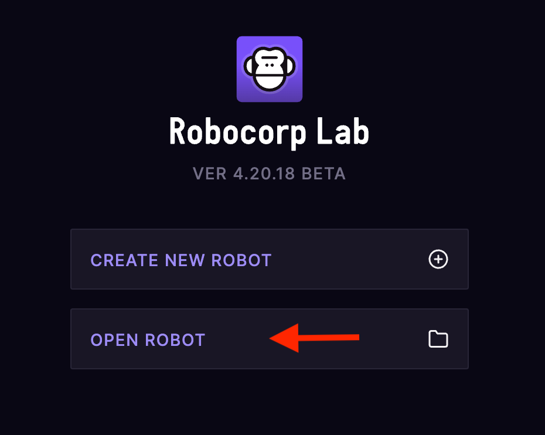

# 🏒 Python Hockey Challenge

_A project template for the [Python Hockey Challenge](https://www.notion.so/thoughtfulautomation/Python-Hockey-Challenge-e31a7aa6929b433fa0c3214bebb83607) by [Thoughtful Automation](https://www.thoughtfulautomation.com)._

**Table of Contents**

- [Prerequisites](#prerequisites)
- [Running](#running)
   - [Via RCC](#via-rcc)
   - [Via Python](#via-python)
   - [Robocorp Cloud](#using-robocorp-cloud)
- [Process Definition Overview](#process-definition-overview)
- [Licenses and Attributions](#licenses-and-attributions)
- [Resource Links](#resource-links)

## Prerequisites

1. Create a [Robocorp Cloud Account](https://id.robocorp.com/signup) (_optional_)
1. Download [Robocorp Lab](https://robocorp.com/docs/developer-tools/robocorp-lab/installation)
   - Optionally, we recommend the [Robocorp VSCode Plugin](https://marketplace.visualstudio.com/items?itemName=robocorp.robocorp-code) to develop and run robots
1. See [Robocorp Developer Guides](https://robocorp.com/docs/setup/development-environment)

## Running

1. Clone this repository to your local machine.
   - Conventionally, clone this repo to the folder `~/Robots/`
2. Open Robocorp Lab, select "Open Robot"
  
3. Open this folder (`bots-ta2-hockey`)
4. In the top menu bar, select `Run` ... `▶️ Robot Test Drive`
5. The robot will begin running, and you'll see the results of the run on your screen.

### Via RCC

Robocorp provides RCC as a CLI to run robots locally. To get started:

1. [Install RCC via these instructions](https://github.com/robocorp/rcc#installing-rcc-from-command-line)
2. Open a terminal and navigate to this folder
3. Run this command to start your robot:
   ```bash
   rcc run
   ```

See the [RCC quickstart documentation](https://robocorp.com/docs/rcc/overview#quickstart) for more information.

### Via Python

No third party packages are needed for this challenge, so you can call `task.py` directly via Python to run your submission locally:

```
$ python3 task.py --help
usage: task.py [-h] input_file output_file

CLI to rank teams from a list of game results

positional arguments:
  input_file   Location of input CSV
  output_file  Location to write output CSV

optional arguments:
  -h, --help   show this help message and exit
```

**Note:** your submission will be run as a robot process via the [Robocorp framework](https://robocorp.com/docs/quickstart-guide) using Python 3.7.5. Please ensure that your submission is structured correctly according to [Robocorp’s documentation](https://robocorp.com/docs/setup/robot-structure).

### Robocorp Cloud

☁ Using Robocorp Cloud is **optional** for this challenge.

See [Control Room Documentation](https://robocorp.com/docs/control-room) for further instructions.

---

## Licenses and Attributions

This source code and documentation is adapted from the ["`Process Invoices with Amazon Textract`"][og:bot] example provided by Robocorp.

📰 See license at [LICENSE](LICENSE).

<br>

## Resource Links

- [RPA certification level I: Beginner's course](https://robocorp.com/docs/courses/beginners-course)
- [Robocorp CLI Tool: RCC](https://github.com/robocorp/rcc)

<!-- Markdown Resource Reference Index -->

[og:bot]: https://robocorp.com/portal/robot/robocorp/example-process-invoices-with-amazon-textract
